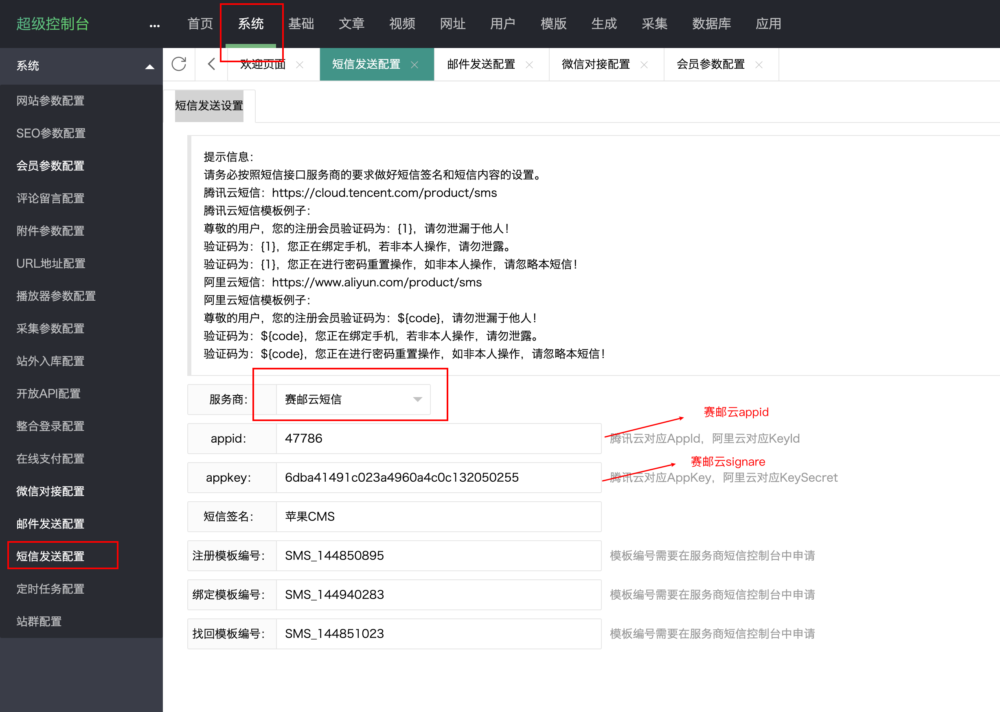

## OVERVIEW

### MACCMS Plug-Ins Overview

>苹果CMS爱好者平台由多个资深站长自由组建的,是以影视系统,漫画系统,小说系统,写真系统,教育系统等内容系统为主的交流学习平台。

------
MACCMS  [官网地址](http://www.maccms.cn/)

How to use

-	applicaiton/common/extend/sms/Submail.php

使用方法
    把下载好的MACCMS 赛邮云短信插件程序解压覆盖到网站根目录
    找到 系统->短信发送设置

    点击安装 后

    配置好申请的appid 和 appkey
[Github项目地址](https://github.com/submail-developers/mac_sms)&nbsp;&nbsp;&nbsp;[点击下载](https://github.com/submail-developers/mac_sms/archive/master.zip)
